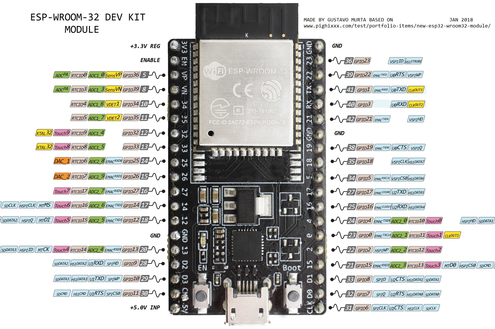

## Librería para el modulo lector de tarjetas RFID.

## En este ejemplo se muestra como usar la librería para leer tarjetas RFID.  
El driver genera una task aparte donde realiza el proceso de lectura de manera periódica.

En la configuración por defecto usamos el puerto SPI3 con los siguientes pines:
```

rc522_config_t config = {
    .spi.host = VSPI_HOST,
    .spi.miso_gpio = 21,
    .spi.mosi_gpio = 23, 
    .spi.sck_gpio = 19,
    .spi.sda_gpio = 22,
    .spi.device_flags= SPI_DEVICE_HALFDUPLEX
};
```

Revisar que su placa de desarrollo coincida con el siguiente pinout.




### Circuito montado


### Resumen del codigo
El driver crea la tarea rc522_task() que llama periódicamente a la función ` rc522_get_tag()` que revisa si hay alguna tarjeta cerca disponible para ser leída.

```

static void rc522_task(void* arg)
{
    rc522_handle_t rc522 = (rc522_handle_t) arg;

    while(rc522->running) {
        if(! rc522->scanning) {
            // Idling...
            vTaskDelay(100 / portTICK_PERIOD_MS);
            continue;
        }

        uint8_t* serial_no_array = NULL;

        if(ESP_OK != rc522_get_tag(rc522, &serial_no_array)) {
            // Tag is not present
            //
            // TODO: Implement logic to know when the error is due to
            //       tag absence or some other protocol issue
        }
        
        if(! serial_no_array) {
            rc522->tag_was_present_last_time = false;
        } else if(! rc522->tag_was_present_last_time) {
            rc522_tag_t tag = {
                .serial_number = rc522_sn_to_u64(serial_no_array),
            };
            FREE(serial_no_array);
            rc522_dispatch_event(rc522, RC522_EVENT_TAG_SCANNED, &tag);
            rc522->tag_was_present_last_time = true;
        } else {
            FREE(serial_no_array);
        }

        int delay_interval_ms = rc522->config->scan_interval_ms;

        if(rc522->tag_was_present_last_time) {
            delay_interval_ms *= 2; // extra scan-bursting prevention
        }

        vTaskDelay(delay_interval_ms / portTICK_PERIOD_MS);
    }

    vTaskDelete(NULL);
}

```

### Pruebas

En las pruebas realizada la librería funciona bien y obtiene el ID de la tarjeta correctamente.


